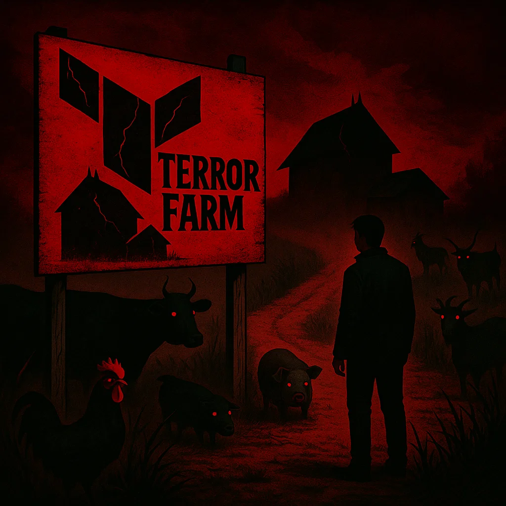

# Multi-Site Hosting Infrastructure

A modern approach to hosting multiple static websites on AWS using Terraform for infrastructure management and separate site repositories for content.

## Architecture Overview

This project uses a **single infrastructure stack** to host multiple static websites efficiently:

```
multi-hosting/
├── platform/           # Terraform infrastructure (IaC)
├── sites/              # Website content repositories
│   └── hiredgnu.net/   # Pelican-generated blog
└── README.md           # This file
```

## Infrastructure Components

**Single Stack Resources:**
- **1 S3 Bucket** - Contains all sites in separate subdirectories
- **1 CloudFront Distribution** - CDN with multiple cache behaviors
- **1 SSL Certificate** - ACM certificate with multiple SANs
- **1 WAF Web ACL** - Rate limiting protection
- **Multiple Route53 Records** - DNS for each domain

**S3 Bucket Structure:**
```
s3-bucket/
└── hiredgnu.net/
    ├── index.html
    └── assets/
```

## Site Types Supported

### Generated Sites (`hiredgnu.net`)
- Pelican static site generator
- Source files in `src/` directory
- Automated build process in deployment script

## Terraform vs CloudFormation

### Why Terraform Over CloudFormation?

#### **Advantages of Terraform:**

1. **Multi-Cloud Support**
   - Can deploy to AWS, Azure, GCP with same code
   - Future-proof if you need to migrate providers

2. **State Management**
   - Remote state locking and collaboration
   - State inspection and manipulation
   - Better team workflow support

3. **Module System**
   - Reusable infrastructure components
   - Community modules (Terraform Registry)
   - Better code organization

4. **Provider Ecosystem**
   - Extensive provider support beyond AWS
   - Consistent interface across providers
   - Active community development

5. **Planning and Preview**
   - `terraform plan` shows exactly what will change
   - More predictable deployments
   - Better change management

6. **Language and Tooling**
   - HCL is more readable than YAML/JSON
   - Better IDE support and syntax highlighting
   - Rich ecosystem of tools

#### **Disadvantages of Terraform:**

1. **Additional Tool to Learn**
   - Team needs Terraform expertise
   - Another dependency in toolchain

2. **State Management Complexity**
   - Need to manage state files/backends
   - Potential for state corruption if mismanaged

3. **Vendor Lock-in to Terraform**
   - While not cloud-locked, you're Terraform-locked
   - Migration away from Terraform can be complex

#### **Advantages of CloudFormation:**

1. **AWS Native Integration**
   - No additional tools required
   - Direct AWS service integration
   - AWS supports CFN natively

2. **Drift Detection**
   - Built-in drift detection capabilities
   - AWS Console integration

3. **Change Sets**
   - Preview changes before deployment
   - Stack-level change management

4. **AWS Support**
   - Direct AWS support for CFN issues
   - Documentation and tutorials from AWS

#### **Disadvantages of CloudFormation:**

1. **AWS Lock-in**
   - Only works with AWS
   - Difficult to migrate to other clouds

2. **Verbose Templates**
   - YAML/JSON can be cumbersome
   - Harder to read and maintain

3. **Limited Modularity**
   - Less flexible than Terraform modules
   - Nested stacks add complexity

4. **Slower Innovation**
   - AWS controls feature releases
   - Less community-driven development

## The Real Reason for Terraform

Honestly? The primary motivation for using Terraform here was to get hands-on experience with it — to overcome a healthy fear of what some might call **Terror Farm**.



It turns out that fear was not entirely unfounded.

## Deployment Process

### 1. Infrastructure Deployment
```bash
cd platform/
terraform init
terraform plan
terraform apply
```

### 2. Site Deployment

#### Pelican Site (hiredgnu.net)
```bash
cd sites/hiredgnu.net/
./deploy.sh
```

## Configuration

### Terraform Variables
Create `platform/terraform.tfvars`:
```hcl
bucket_name    = "your-multi-site-bucket"
hosted_zone_id = "Z1EXAMPLE123456"

websites = [
  {
    fqdn        = "hiredgnu.net"
    domain_name = "hiredgnu.net"
    path_prefix = "hiredgnu.net"
  }
]
```

### Site Deployment Scripts
Both sites include automated deployment scripts that:
- Build (if required)
- Sync to S3 with proper cache headers
- Invalidate CloudFront cache
- Handle errors gracefully

## Best Practices Implemented

### Infrastructure
- **Single stack approach** - Cost-effective and manageable
- **Path-based routing** - Clean S3 organization
- **SSL certificates with SANs** - Support multiple domains
- **WAF protection** - Security by default
- **Proper tagging** - Resource management

### Site Management
- **Separation of concerns** - Infrastructure vs content
- **Automated deployment** - Consistent and error-free
- **Git-friendly structure** - Version control for everything
- **Scalable approach** - Easy to add new sites

### Cost Optimization
- **Shared resources** - Single CloudFront distribution
- **Efficient caching** - Proper cache headers
- **S3 lifecycle policies** - Can be added as needed

## Migration from CloudFormation

If migrating from CloudFormation:

1. **Import existing resources** into Terraform state
2. **Update deployment pipelines** to use Terraform
3. **Train team** on Terraform workflows
4. **Establish state management** practices
5. **Gradual cutover** to avoid downtime

## Future Enhancements

- **Add more sites** - Simply add to `terraform.tfvars`
- **CI/CD integration** - GitHub Actions for automated deployment
- **Monitoring** - CloudWatch alarms and dashboards
- **Security** - Additional WAF rules and S3 policies
- **Performance** - CloudFront optimizations and edge functions

## Troubleshooting

### Common Issues
- **SSL certificate validation** - Ensure Route53 records are created
- **CloudFront cache** - Use invalidation after updates
- **S3 permissions** - Verify bucket policies and IAM roles
- **Domain propagation** - DNS changes can take time

### Debug Commands
```bash
# Check Terraform state
cd platform/ && terraform show

# Check S3 contents
aws s3 ls s3://your-bucket/

# Check CloudFront distribution
aws cloudfront get-distribution --id YOUR-DISTRIBUTION-ID

# Check SSL certificate
aws acm describe-certificate --certificate-arn YOUR-CERT-ARN
```

## Conclusion

This Terraform-based approach provides a modern, scalable, and maintainable solution for multi-site hosting. The separation of infrastructure and content, combined with automated deployment scripts, creates an efficient workflow that can easily scale to support additional sites while maintaining security and performance standards.
